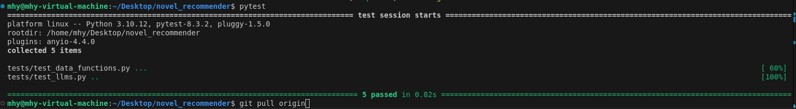
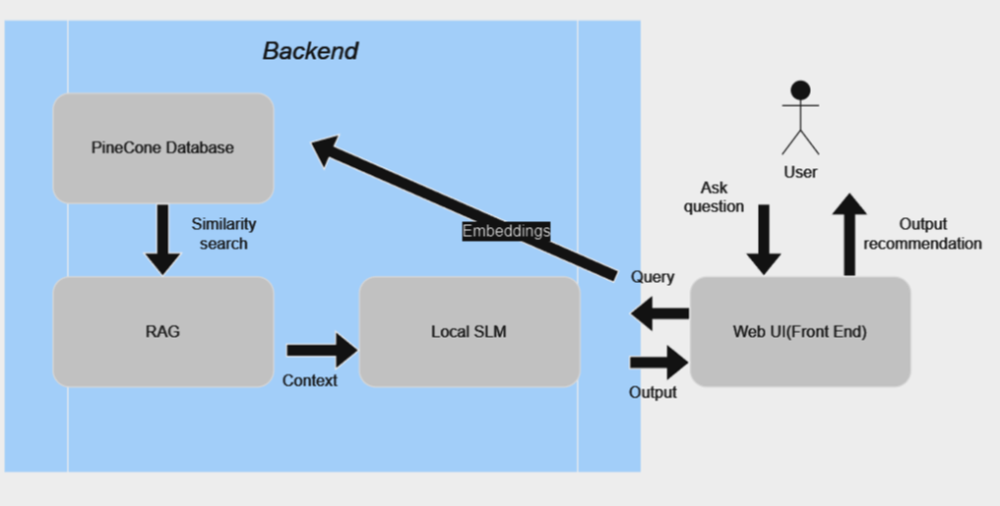
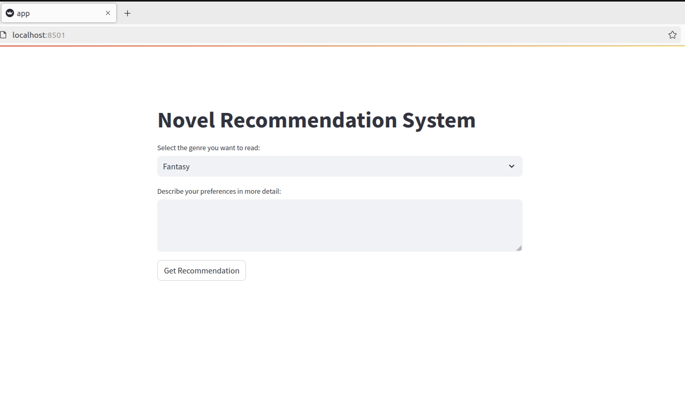
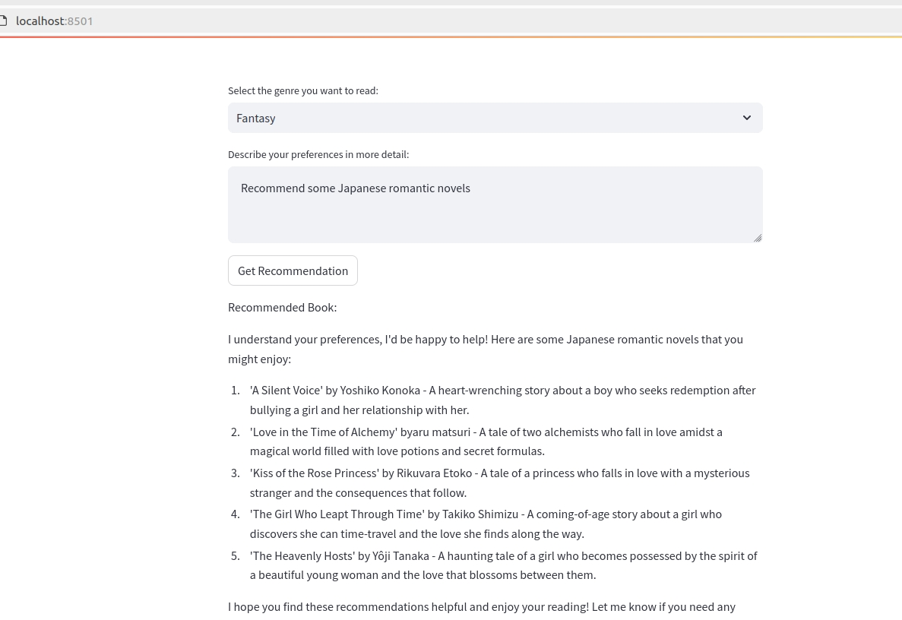
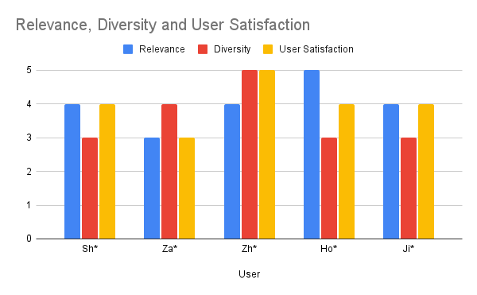
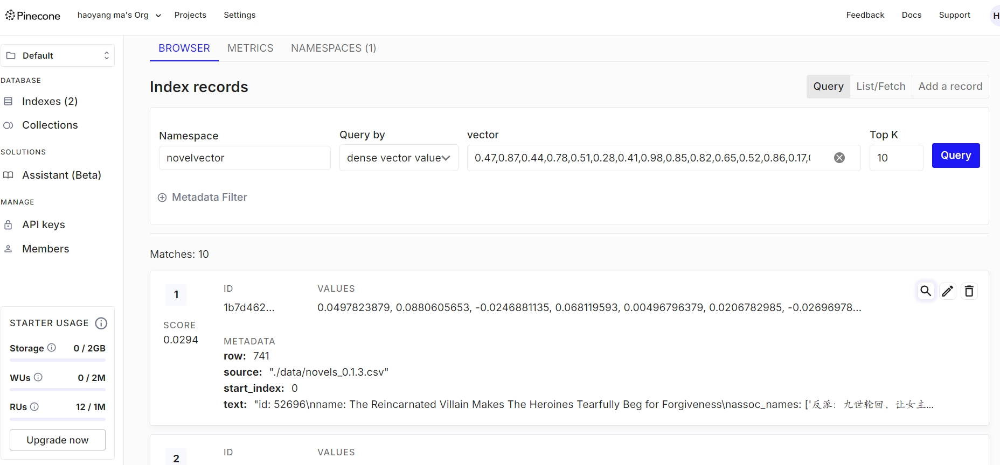
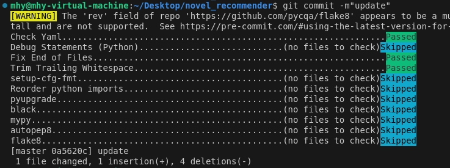

## Project Goal
I personally enjoy reading novels and manga comics very much. I believe many people, like me, need personalized recommendations to find content they are interested in. Traditional recommendation systems usually rely on users' historical data and ratings, but these methods may not meet the needs of those who want to explore more detailed/specific subjects or try some new subjects.

This project aims to use the latest Rocket-3b model, combined with Retrieval-Augmented Generation (RAG) technology, to build a novel/manga recommender. Users can input the novel or manga genres or tags they are interested in, and the system will query the relevant database and generate a personalized recommendation list.

## Timeline(Week)
1. Investigate the Rocket-3b model and the usage of LLamafile.

2. Collect and preprocess relevant data for novels and manga.

3. Configure and test the LLaMA3 instruct model with LLamafile.

4. Develop and test the backend API with RAG mechanism.

5. Continue backend development and testing.

6. Design and implement the frontend interface.

7. Optimize the frontend based on user feedback.

8. Integrate the frontend and backend systems.

9. Deploy the services to a local server and conduct initial testing.

10. Perform comprehensive testing and optimize the system.

## Unit Tests
In the folder named 'tests', there are unit tests for the core functionality.



## Docker container


# Novel Recommender System


## [Demo Video](https://youtu.be/OW7QmgCyYPM)

## Architecture Diagram



## Project Structure

```
.
├── src
    ├── data_processing.py
    ├── LLMs.py
    ├── rag.py
    ├── embedding.py
├── tests
    ├── unittests.py
├── notebook
├── data
    ├── data related files
├── Dockerfile
├── requirements.txt
├── README.md
├── .env
└── .github
    └── workflows
        └── action.yml
```

### Overview of Key Files

- **data_processing.py**: Functions for loading and preprocessing data.
- **LLMs.py**: Functions related to the use of large language models.
- **rag.py**: Implementation of Retrieval-Augmented Generation for novel recommendations.
- **embedding.py**: Functions for embedding text data using Pinecone.

## Setup Instructions

### Prerequisites

- Ubuntu system
- Docker installed
- GitHub account for accessing the repository and packages

### Cloning the Repository

```bash
git clone https://github.com/mhy-666/novel_recommender.git
cd novel_recommender
```

### Setting Up Environment Variables

Create a `.env` file in the root directory and add the following variables:

```
PINECONE_API_KEY=your_pinecone_api_key
```

### Building and Running the Docker Container

1. **Build the Docker image:**

```bash
docker build -t novel-recommender:latest .
```

2. **Run the Docker container:**

```bash
docker run -d -p 8501:8501 --network host --name novel_recommender novel_recommender
```

### Accessing the Application

Open your web browser and go to `http://localhost:8501` to access the Streamlit front-end.

### Testing the Application

1. **Unit Tests:**

```bash
docker exec -it novel-recommender pytest tests/
```

2. **Example Query:**

   - Open the web application.
   - Enter a query like "Find me a fantasy novel".
   - Observe the recommendations provided by the system.

### Screenshots





## Performance and Evaluation Results

The performance of the novel recommender system was evaluated using human evaluation, which involved assessing the quality of recommendations by real users. The evaluation process included the following steps:

### Evaluation Criteria:

**Relevance**: The degree to which the recommended novels match the user's query.

**Diversity**: The variety of recommendations provided.

**User Satisfaction**: Overall satisfaction with the recommendations.

### Results:

**Relevance**: The system achieved an average relevance score of 4 out of 5.

**Diversity**: The average diversity score was 3.6 out of 5.

**User Satisfaction**: The overall user satisfaction score was 4 out of 5.



## Vector Database



## CI/CD Pipeline

I choose Github Actions for my CI/CD pipeple. The pipeline is defined in the `github-actions.yml` file, which includes steps for:

- Installing Python dependencies
- Checking code formatting and linting
- Building the Docker image
- Running tests
- Pushing the Docker image to GitHub Packages

Here is the translated introduction to your README file in English:

---

### Code Quality Checks

We use Continuous Integration and Continuous Deployment (CI/CD) tools to ensure code quality and automate processes. The key components of our CI/CD pipeline include:

- **CI/CD Toolchain**: GitHub Actions is used for automated builds, tests, and deployments.
- **Code Formatting**: Automated code formatting is handled by `black`.
- **Code Sorting**: The `isort` tool automatically sorts `import` statements.
- **Code Checking**: `flake8` is used for code style checks.
- **Static Code Analysis**: `autoflake` is used to remove unused variables and imports.
- **Automatic Fixing**: The `pre-commit` tool is configured to run code formatting and checking tools before each commit.


To maintain high code quality, we have integrated the `pre-commit` tool into our CI/CD process to handle code formatting and checking. `pre-commit` is a tool for setting up Git hooks that automatically run a series of code quality tools before each commit.



#### Configuration File

The `pre-commit` configuration file is `.pre-commit-config.yaml` and includes the following hooks:

```yaml
repos:
  - repo: https://github.com/pre-commit/pre-commit-hooks
    rev: v3.4.0
    hooks:
      - id: trailing-whitespace
      - id: end-of-file-fixer

  - repo: https://github.com/psf/black
    rev: 22.12.0
    hooks:
      - id: black

  - repo: https://github.com/pre-commit/mirrors-isort
    rev: v5.12.0
    hooks:
      - id: isort
```

#### Installation and Usage

To install `pre-commit` and set up hooks, follow these steps:

1. **Install `pre-commit`**:

   ```bash
   pip install pre-commit
   ```

2. **Install Git Hooks**:

   ```bash
   pre-commit install
   ```

3. **Manually Run All Hooks (Optional)**:

   ```bash
   pre-commit run --all-files
   ```


##### Demonstrate that you've taken a risk to learn something new, incorporated a cool new framework/technology, or gone above and beyond the minimum requirements


Since my computer runs on Windows, I couldn't use Docker initially. I wasn't aware of this because I had little exposure to Docker at the beginning, which led me to develop all my code based on the Windows system. It was only when I needed to use Docker that I realized Windows does not support Docker. After much consideration, I decided to use a virtual machine service because a virtual machine can run a Linux system. I set up a virtual machine on my computer, configured the environment (Ubuntu), and then modified the code to adapt it to the Linux environment. Finally, I successfully set up Docker and started it on Ubuntu. I believe this change in the system and the use of Docker introduced some risks in my project development. Additionally, since Docker was entirely new to me, I encountered many challenges and spent considerable time learning, particularly with establishing communication between services inside Docker and the external LlamaFile model.
