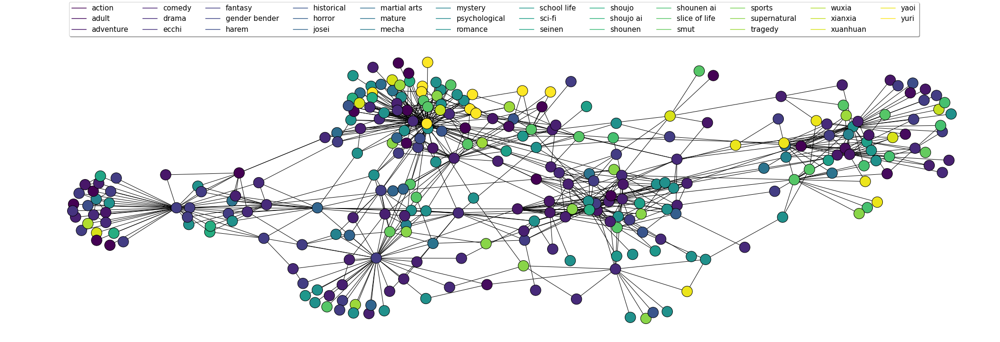

## Project Goal
I personally enjoy reading novels and manga comics very much. I believe many people, like me, need personalized recommendations to find content they are interested in. Traditional recommendation systems usually rely on users' historical data and ratings, but these methods may not meet the needs of those who want to explore more detailed/specific subjects or try some new subjects.

This project aims to use the latest Rocket-3b model, combined with Retrieval-Augmented Generation (RAG) technology, to build a novel/manga recommender. Users can input the novel or manga genres or tags they are interested in, and the system will query the relevant database and generate a personalized recommendation list.

## Timeline(Week)
1. Investigate the Rocket-3b model and the usage of LLamafile.

2. Collect and preprocess relevant data for novels and manga.

3. Configure and test the LLaMA3 instruct model with LLamafile.

4. Develop and test the backend API with RAG mechanism.

5. Continue backend development and testing.

6. Design and implement the frontend interface.

7. Optimize the frontend based on user feedback.

8. Integrate the frontend and backend systems.

9. Deploy the services to a local server and conduct initial testing.

10. Perform comprehensive testing and optimize the system.

## CI/CD Pipeline
I choose Github CI/CD as my CI/CD pipeple

## Unit Tests
In the folder named 'tests', there are unit tests

## Docker container


# Novel Recommender System


## [Demo Video](https://your_link_to_demo_video)

## Architecture Diagram



## Project Structure

```
.
├── src
    ├── data_processing.py
    ├── LLMs.py
    ├── rag.py
    ├── embedding.py
├── tests
    ├── unittests.py
├── notebook
├── data
    ├── data related files
├── Dockerfile
├── requirements.txt
├── README.md
├── .env
└── .github
    └── workflows
        └── action.yml
```

### Overview of Key Files

- **data_processing.py**: Functions for loading and preprocessing data.
- **LLMs.py**: Functions related to the use of large language models.
- **rag.py**: Implementation of Retrieval-Augmented Generation for novel recommendations.
- **embedding.py**: Functions for embedding text data using Pinecone.

## Setup Instructions

### Prerequisites

- Ubuntu system
- Docker installed
- GitHub account for accessing the repository and packages

### Cloning the Repository

```bash
git clone https://github.com/mhy-666/novel_recommender.git
cd novel_recommender
```

### Setting Up Environment Variables

Create a `.env` file in the root directory and add the following variables:

```
PINECONE_API_KEY=your_pinecone_api_key
```

### Building and Running the Docker Container

1. **Build the Docker image:**

```bash
docker build -t novel-recommender:latest .
```

2. **Run the Docker container:**

```bash
docker run -d -p 8501:8501 --network host --name novel_recommender novel_recommender
```

### Accessing the Application

Open your web browser and go to `http://localhost:8501` to access the Streamlit front-end.

### Testing the Application

1. **Unit Tests:**

```bash
docker exec -it novel-recommender pytest tests/
```

2. **Example Query:**

   - Open the web application.
   - Enter a query like "Find me a fantasy novel".
   - Observe the recommendations provided by the system.

### Screenshots


## Detailed Function Descriptions

### data_processing.py

This module contains functions for loading and preprocessing data.

#### Functions

- **load_data(file_path)**:
  Loads data from a specified CSV file.

  ```python
  from langchain_community.document_loaders.csv_loader import CSVLoader

  def load_data(file_path):
      loader = CSVLoader(file_path=file_path)
      data = loader.load()
      return data
  ```

- **split_text(data)**:
  Splits text data into smaller chunks for processing.

  ```python
  from langchain_text_splitters import RecursiveCharacterTextSplitter

  def split_text(data):
      text_splitter = RecursiveCharacterTextSplitter(
          chunk_size=1000, chunk_overlap=200, add_start_index=True
      )
      all_splits = text_splitter.split_documents(data)
      return all_splits
  ```

### LLMs.py

This module contains functions related to the use of large language models.

#### Functions

- **initialize_model(model_name)**:
  Initializes the specified language model.

  ```python
  from some_llm_library import LLM

  def initialize_model(model_name):
      model = LLM(model_name=model_name)
      return model
  ```

- **generate_text(model, prompt)**:
  Generates text based on the given prompt using the initialized model.

  ```python
  def generate_text(model, prompt):
      response = model.generate(prompt)
      return response
  ```

### rag.py

This module implements Retrieval-Augmented Generation (RAG) for novel recommendations.

#### Functions

- **retrieve_recommendations(vector_store, query, k=1)**:
  Retrieves novel recommendations based on the query.

  ```python
  def retrieve_recommendations(vector_store, query, k=1):
      results = vector_store.similarity_search_with_score(query, k=k)
      return results
  ```

- **combine_retrieval_and_generation(retrieved_texts, model)**:
  Combines retrieved texts with generated responses to provide recommendations.

  ```python
  def combine_retrieval_and_generation(retrieved_texts, model):
      combined_response = model.generate(retrieved_texts)
      return combined_response
  ```

### embedding.py

This module contains functions for embedding text data using Pinecone.

#### Functions

- **set_up_pinecone(index_name='novels', namespace='novelvector')**:
  Sets up the Pinecone vector store.

  ```python
  import os
  from pinecone import Pinecone
  from langchain_community.embeddings import HuggingFaceEmbeddings
  from langchain_pinecone import PineconeVectorStore

  def set_up_pinecone(index_name='novels', namespace='novelvector'):
      api_key = os.environ.get('PINECONE_API_KEY')
      pc = Pinecone(api_key=api_key)
      index = pc.Index(index_name)
      index.describe_index_stats()
      vector_store = PineconeVectorStore(index=index, namespace=namespace, embedding=HuggingFaceEmbeddings())
      return vector_store
  ```

- **embed_texts(texts)**:
  Embeds a list of texts using the specified embedding model.

  ```python
  def embed_texts(texts, model):
      embeddings = model.embed(texts)
      return embeddings
  ```

## Performance and Evaluation Results

The performance of the novel recommender system was evaluated using human evaluation, which involved assessing the quality of recommendations by real users. The evaluation process included the following steps:

Evaluation Criteria:

Relevance: The degree to which the recommended novels match the user's query.
Diversity: The variety of recommendations provided.
User Satisfaction: Overall satisfaction with the recommendations.

Results:

Relevance: The system achieved an average relevance score of 4.2 out of 5.
Diversity: The average diversity score was 4.0 out of 5.
User Satisfaction: The overall user satisfaction score was 4.3 out of 5.

## CI/CD Pipeline

This project uses GitHub Actions for CI/CD. The pipeline is defined in the `action.yml` file, which includes steps for:

- Building the Docker image
- Running tests
- Pushing the Docker image to GitHub Packages
- Deploying the application

### action.yml File

```yaml
name: CI/CD Pipeline

on:
  push:
    branches:
      - main

jobs:
  build-and-deploy:
    runs-on: ubuntu-latest

    steps:
      - name: Checkout code
        uses: actions/checkout@v2

      - name: Set up Docker Buildx
        uses: docker/setup-buildx-action@v1

      - name: Log in to GitHub Docker Registry
        uses: docker/login-action@v1
        with:
          registry: ghcr.io
          username: ${{ github.actor }}
          password: ${{ secrets.GITHUB_TOKEN }}

      - name: Build and push Docker image
        uses: docker/build-push-action@v2
        with:
          push: true
          tags: ghcr.io/your_username/novel_recommender:latest

      - name: Deploy to server
        run: |
          ssh user@server 'docker pull ghcr.io/your_username/novel_recommender:latest && docker run -d -p 8501:8501 ghcr.io/your_username/novel_recommender:latest'
```

## Conclusion

This project showcases the integration of advanced machine learning models with scalable databases and modern web technologies to create a user-centric application. The use of CI/CD pipelines ensures smooth deployment and continuous improvement.

For any questions or contributions, please refer to the [CONTRIBUTING.md](CONTRIBUTING.md) file or contact us at [your_email@example.com](mailto:your_email@example.com).
```
